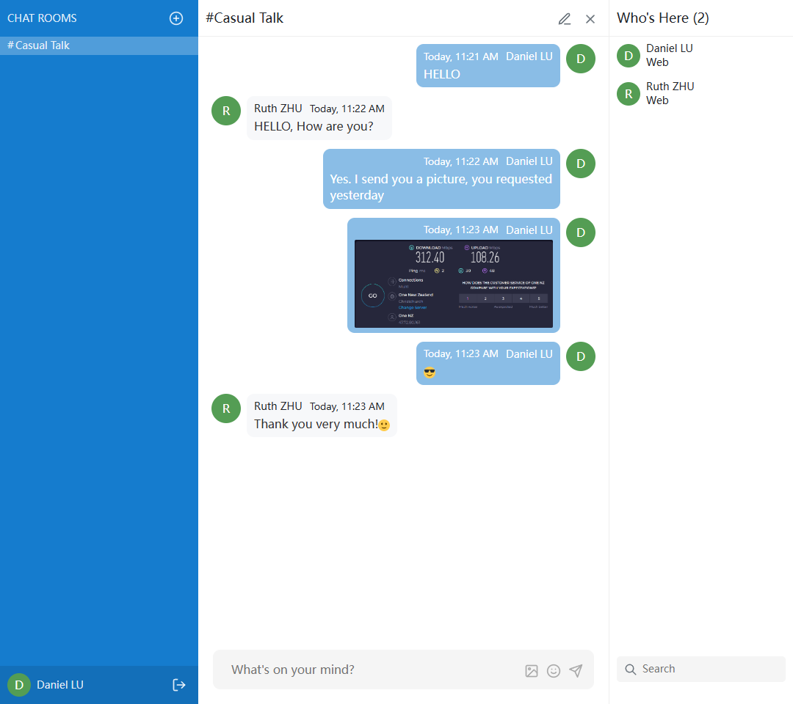
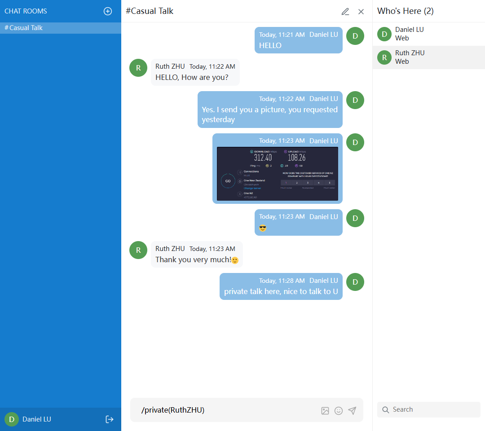
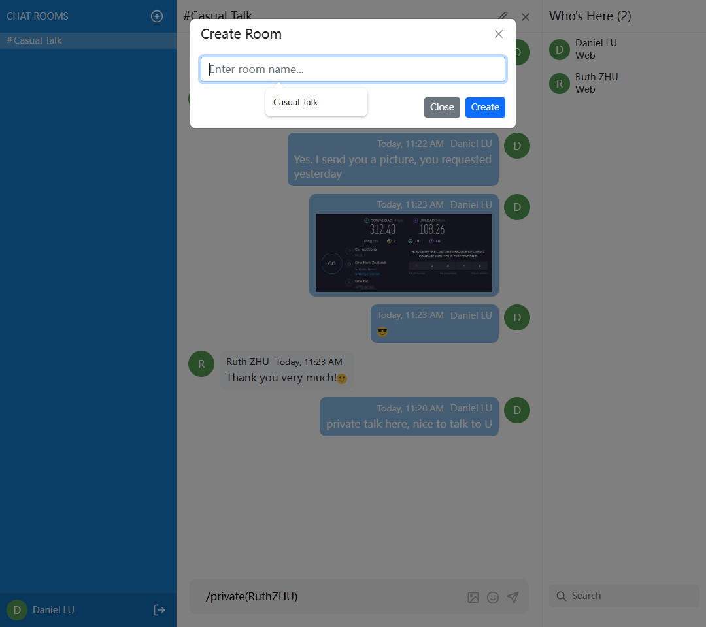
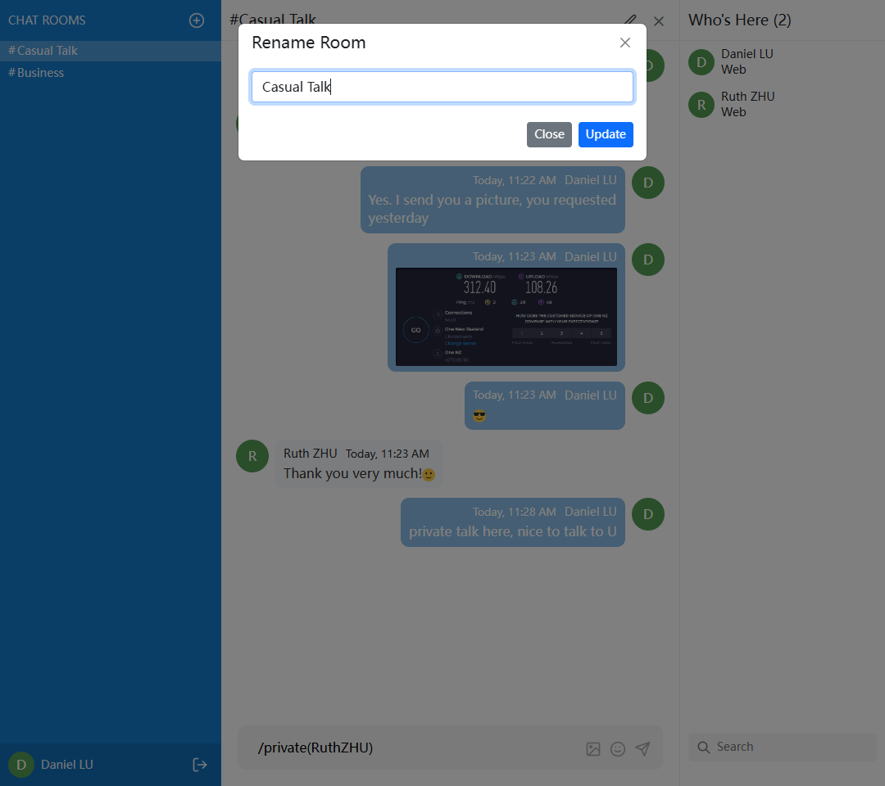
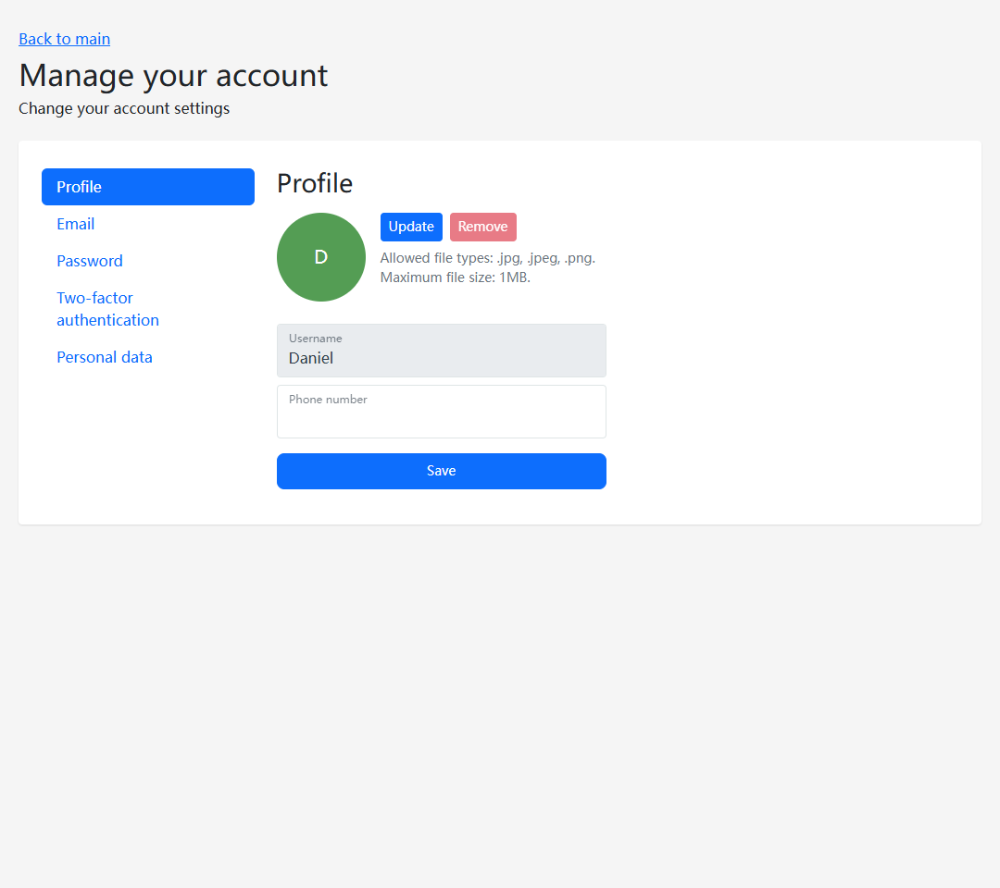

# .net-Core.signalR.Chat
Real-time chat application with room support, user presence, and instant messaging. Built using .NET 7 (backend), SignalR (real-time communication), and KnockoutJS (frontend).

## Tech Stack
- .NET 7

- ASP.NET CORE
- .NET CORE Razor Pages and Controllers
- Entity Framework Core
- Identity Framework
- SignalR
- Automapper
- Dependency Injection
- File Validation
- HTTPS Redirection
- Error Handling
- Sql Server
- KnockoutJS

## Features

- [ ] Group Chat

- [ ] Private Chat 
- [ ] Chatroom (CRUD)
- [ ] Photo messages
- [ ] Search users
- [ ] Basic Emojis
- [ ] Register, Login, Logout
- [ ] Account management(profile, psw, etc)

## How to install

1. Grab the Project

2. Open Visual Studio as Administrator and load the Solution,
   or double-click <u>Chat.sln</u>

3. Edit ConnectionString at file <u>appsettings.json</u>

4. Build Database.

   Open Package Manager Console and run the following commands:

   ​	update-database

5. That's all... Enjoy the Project!

## Screenshots

Talk in the lobby / public chat room

Click a user and Send private message

Create a new room then you are the Admin

You can edit and delete that room

Manage your account.

